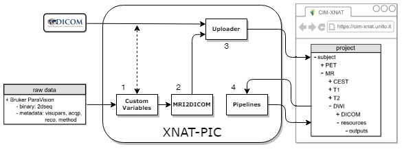
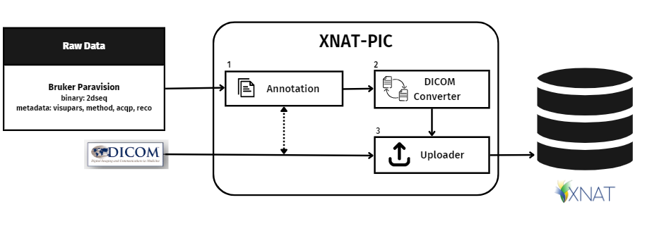
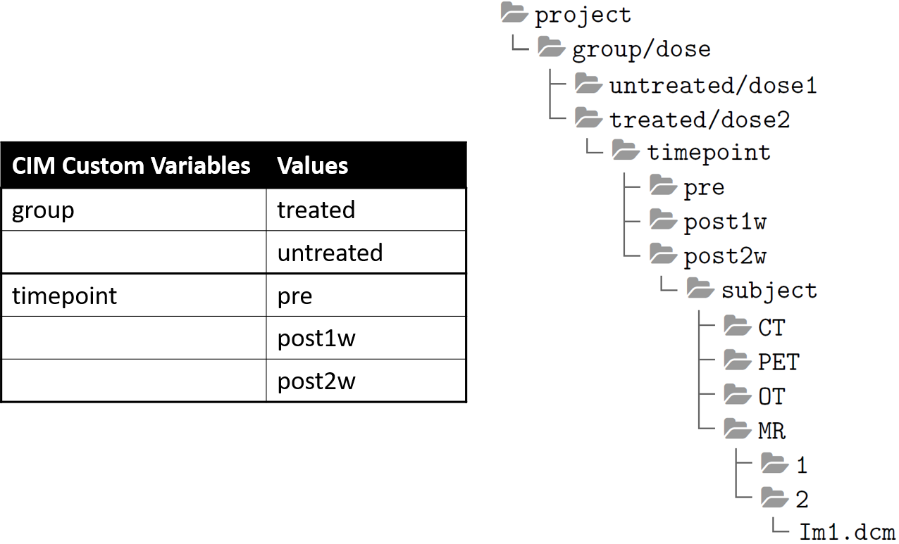
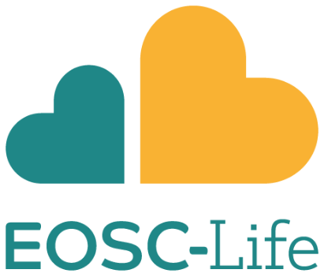

<!--
*** Thanks for checking out the Best-README-Template. If you have a suggestion
*** that would make this better, please fork the repo and create a pull request
*** or simply open an issue with the tag "enhancement".
*** Thanks again! Now go create something AMAZING! :D
-->


<!-- PROJECT SHIELDS -->
<!--
*** I'm using markdown "reference style" links for readability.
*** Reference links are enclosed in brackets [ ] instead of parentheses ( ).
*** See the bottom of this document for the declaration of the reference variables
*** for contributors-url, forks-url, etc. This is an optional, concise syntax you may use.
*** https://www.markdownguide.org/basic-syntax/#reference-style-links
-->

  [![Contributors][contributors-shield]][contributors-url]
  [![Forks][forks-shield]][forks-url]
  [![Stargazers][stars-shield]][stars-url]
  [![Issues][issues-shield]][issues-url]
  [![License][license-shield]][license-url]


<!-- PROJECT LOGO -->
  <a href="https://www.eurobioimaging.eu/">
    
  </a>

# XNAT-PIC

XNAT for Preclinical Imaging Centers (XNAT-PIC) is a free and open-source Windows desktop application, which offers several tools to expand the XNAT core functionalities to support
the preclinical imaging community and to promote open science practices.

<!-- TABLE OF CONTENTS -->

## Table of Contents
<ol>
  <li>
    <a href="#about">About</a>
    <ul>
      <li><a href="#built-with">Built With</a></li>
    </ul>
  </li>
  <li>
    <a href="#getting-started">Getting Started</a>
    <ul>
      <li><a href="#prerequisites">Prerequisites</a></li>
      <li><a href="#installation">Installation</a></li>
    </ul>
  </li>
  <li><a href="#stand-alone">Stand-alone SW</a></li>
  <li><a href="#usage">Usage</a></li>
  <li><a href="#roadmap">Roadmap</a></li>
  <li><a href="#contributing">Contributing</a></li>
  <li><a href="#license">License</a></li>
  <li><a href="#LINKS">LINKS</a></li>
  <li><a href="#citation">Citation</a></li>
  <li><a href="#news">News</a></li>
  <li><a href="#contact">Contact</a></li>
  <li><a href="#funding">Funding</a></li>
  <li><a href="#acknowledgments">Acknowledgments</a></li>
</ol>

<!-- ABOUT THE PROJECT -->
# About

<!--  -->


**XNAT for Preclinical Imaging Centers (XNAT-PIC)** has been developed to expand XNAT's basic functionalities to preclinical imaging and consists of:

1. **Grouping Annotation Interface** to efficiently cope with different experimental protocols by labelling subjects with dedicated Custom Variables to manage several types of cohorts (e.g. treated/untreated, timepoints, doses, etc..)
2. **MRI2DICOM Converter** to convert Bruker raw data to DICOM standard, including DICOM tags for new MRI modalities, such as Chemical Exchange Saturation Transfer (CEST)
3. **Uploader** to easily import DICOM image datasets into the XNAT platform. It supports upload of whole projects, or of sessions, subjects and experiments (scans)

## Built With

XNAT-PIC has been built by using the following major frameworks:

* [XNAT](https://www.xnat.org/)
* [Python](https://www.python.org/)

<!-- GETTING STARTED -->
# Getting Started

This section contains instructions on **setting up XNAT-PIC** on your computer, in both Linux and Windows OS.<br>
Make sure you have the following softwares and packages in place:

* [XNAT 1.8.7.1](https://www.xnat.org/)
* [Python 3.7.6 and Python 2.7](https://www.python.org/)
* [Numpy 1.15.4](https://pypi.org/project/numpy/1.15.4/) and [Numpy 1.18.5](https://pypi.org/project/numpy/1.18.5/) 
* [pyAesCrypt 0.4.3](https://pypi.org/project/pyAesCrypt/0.4.3)
* [Pydicom 1.2.1](https://pypi.org/project/pydicom/1.2.1)
* [xnatpy 0.4.3](https://pypi.org/project/xnat/0.3.22)
* [pyxnat-1.2.1.0.post3](https://pypi.org/project/pyxnat/1.2.1.0.post3/)
* [Requests 2.23.0](https://pypi.org/project/requests/2.23.0)
* [opencv-python 4.4.0.40](https://pypi.org/project/opencv-python/4.4.0.40/)
* [nibabel 3.1.1](https://pypi.org/project/nibabel/3.1.1/)

## Prerequisites
XNAT-PIC requires an XNAT instance to work with, therefore you first need to install XNAT on a local desktop or server. XNAT-PIC has been designed and tested for **XNAT 1.8.7.1**: we recommend to install this version. You can find the XNAT installation guide at the following link https://wiki.xnat.org/documentation/getting-started-with-xnat/xnat-installation-guide.
If you need help with the XNAT installation, please get in touch with us! <br>

## Installation

### From the source code

1. Clone the repo
   ```sh
   git clone https://github.com/cim-unito/XNAT-PIC.git
   ```

2. Install [Python 3.7.6](https://docs.python.org/release/3.7.6/) or, alternatively, [Anaconda](https://www.anaconda.com/) 

3. Install Python Packages from the requirements file with the following command:
   ```sh
   pip install -r requirements.txt
   ```
<!-- Stand-alone SW -->
# Stand-alone 

XNAT-PIC is available for download and immediately usable without requiring additional configurations on the [Molecular Imaging Center - University of Turin website](https://www.cim.unito.it/website/research/research_xnat.php).

<!-- USAGE EXAMPLES -->
# Usage

You can launch XNAT-PIC by running `launcher.py` in your Python IDE or via operating system command-line or terminal:

```
$ python launcher.py
```

Users can then click on:

* **DICOM Converter** to convert the ParaVision® (Bruker, Inc. Billerica, MA) raw data to DICOM standard. The converter needs to know the directory of the project in ParaVision® format. Once the process is over, a new folder with the DICOM images will be created in the same directory
* **Edit Custom Variables** to open an interface designed with features and functions that allow users to easily group
and categorize information regarding preclinical images
* **Uploader** to import the MR image sessions to XNAT, if your images are already in DICOM The DICOM image dataset can be then uploaded to XNAT. XNAT-PIC Uploader can upload a single subject or multiple subjects. You need to provide the XNAT webpage address and the login details. Then users can create a new project or select a pre-existing one in the drop-down menu, browse to the directory and type the number of custom variables. A pop-up window notifies the user once the process is complete 

When uploading DICOM images to XNAT the user can also adopt a more complex structure that automatically sets **custom variables** (up to 3) and their values. For example, this data tree structure corresponds to the following custom variables and values:

<p align="center">
  <a >
    
  </a>

For more information about custom variables in XNAT, please visit: https://wiki.xnat.org/documentation/how-to-use-xnat/creating-and-managing-projects/adding-custom-variables-to-xnat-projects

<!-- ROADMAP -->
# Roadmap

Please visit [open issues](https://github.com/ricgambino/XNAT-PIC/issues) for a list of proposed features (and known issues).

<!-- CONTRIBUTING -->
# Contributing

Contributions are **greatly appreciated**. <br>
If you wish to help us in improving the XNAT-PIC project, please follow these instructions.

1. Fork the Project
2. Create your Feature Branch (`git checkout -b feature/XNAT-PIC-new-feature`)
3. Commit your Changes (`git commit -m 'Add some XNAT-PIC-new-feature'`)
4. Push to the Branch (`git push origin feature/XNAT-PIC-new-feature`)
5. Open a Pull Request

Thank you!

<!-- LICENSE -->
# License

XNAT-PIC is distributed under the terms of the GNU General Public License (GPL) v3 or any later version as stated by the Free Software Foundation. See [`LICENSE`](https://github.com/szullino/XNAT-PIC-Readme/blob/master/LICENSE.txt) for more information.
  
<!-- LINKS -->
# Links

XNAT-PIC was built using [ttkbootstrap](https://github.com/israel-dryer/ttkbootstrap/) theme extension and [Icons8](https://icons8.com/) icons.

<!-- CITATION -->
# Citation

Please, **cite these repositories** by using: <br>

* S. Zullino, A. Paglialonga, W. Dastrù, D. L. Longo, S. Aime. XNAT-PIC: Extending XNAT to Preclinical Imaging Centers, 2021. DOI: https://arxiv.org/abs/2103.02044

<!-- News -->
# News 

* "Demonstrator 5: XNAT-PIC: expanding XNAT for image archiving and processing to Preclinical Imaging Centers". EOSC-Life website, https://www.eosc-life.eu/d5/

* "Towards sharing and reusing of preclinical image data". Euro-Bioimaging website, https://www.eurobioimaging.eu/news/towards-sharing-and-reusing-of-preclinical-image-data/

* "Data Management: Biological and Preclinical Imaging Perspective". Euro-Bioimaging Virtual Pub, February 12th, 2021. <br>
[](https://youtu.be/QNiAGuFk53w "")

* "XNAT-PIC: expanding XNAT for image archiving and processing to Preclinical Imaging Centers". Demonstrator 5 from Populating EOSC-Life: Success stories for the Demonstrators – Session 1 from January 13, 2021.<br>
[](https://youtu.be/cpEcfIJJqCo "")
  
<!-- CONTACT -->
# Contact
**Francesco Gammaraccio** <br>
Molecular Imaging Center<br>
Department of Molecular Biotechnology and Health Sciences <br>
<a  href="https://en.unito.it/">
     <br>
  </a>
Via Nizza 52 | 10126 Torino, Italy<br>
francesco.gammaraccio@unito.it | T +39 011 670 6473
  
**Kranthi Thej Kandula** <br>
Molecular Imaging Center<br>
Department of Molecular Biotechnology and Health Sciences <br>
<a  href="https://en.unito.it/">
     <br>
  </a>
  Via Nizza 52 | 10126 Torino, Italy<br>
kranthithej.kandula@unito.it | T +39 011 670 6473

<!-- Funding -->
# Funding
European Union’s Horizon 2020 research and innovation programme under grant agreements #824087 (EOSC-
LIFE project), #965345 (HealthyCloud project), #101058427 (EOSC4Cancer project) and # 1011100633
(EUCAIM project).
  
<a href="https://www.eosc-life.eu/">
    &nbsp;&nbsp;&nbsp;
  </a>

<a href="https://healthycloud.eu/">
     &nbsp;&nbsp;&nbsp;
  </a>

<a href="https://eosc4cancer.eu/">
    
  </a>
  
<a href="https://eucanimage.eu/">
    
  </a>

<!-- Acknowledgments -->
# Acknowledgments
  
* Alessandro Paglialonga: https://github.com/pagli17
* Stefan Klein, Hakim Achterberg and Marcel Koek - Biomedical Imaging Group Rotterdam, Erasmus Medical Center, Rotterdam
* Matteo Caffini, “Project-Beat--Pyhton”: https://github.com/mcaffini/Project-Beat---Python
* Sara Zullino: https://github.com/szullino

<!-- MARKDOWN LINKS & IMAGES -->
<!-- https://www.markdownguide.org/basic-syntax/#reference-style-links -->
[contributors-shield]: https://img.shields.io/github/contributors/szullino/XNAT-PIC
[contributors-url]: https://github.com/szullino/XNAT-PIC/graphs/contributors
[forks-shield]: https://img.shields.io/github/forks/szullino/XNAT-PIC
[forks-url]: https://github.com/szullino/XNAT-PIC/network/members
[stars-shield]: https://img.shields.io/github/stars/szullino/XNAT-PIC 
[stars-url]: https://github.com/szullino/XNAT-PIC/stargazers
[issues-shield]: https://img.shields.io/github/issues/szullino/XNAT-PIC
[issues-url]: https://github.com/szullino/XNAT-PIC/issues
[license-shield]: https://img.shields.io/github/license/szullino/XNAT-PIC
[license-url]: https://github.com/szullino/XNAT-PIC/blob/master/LICENSE.md
[linkedin-shield]: https://img.shields.io/badge/LinkedIn-blue/?style=flat&logo=linkedin&color=0088CC&labelColor=blue
[linkedin-url]: https://www.linkedin.com/in/sarazullino/
[publons-shield]: https://img.shields.io/badge/Publons-blue/?style=flat&logo=publons&color=0088CC&labelColor=blue
[publons-url]: https://publons.com/researcher/3602369/sara-zullino/
[twitter-url]: https://twitter.com/szullina
[twitter-shield]: https://img.shields.io/badge/Twitter-blue/?style=flat&logo=twitter&color=FFFFFF&labelColor=white
[xnat-pic-screenshot]: images/Fig1.png


