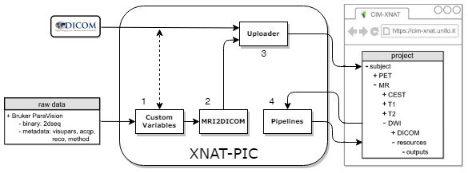

<!-- PROJECT LOGO -->
  

---

# XNAT-PIC

XNAT for Preclinical Imaging Centers (XNAT-PIC) is a free and open-source Windows desktop application, which offers several tools to expand the XNAT core functionalities to support
the preclinical imaging community and to promote open science practices.

---

## Table of Contents
- [About](#about)
- [Roadmap](#roadmap)
- [License](#license)
- [Citation](#citation)
- [News](#news)
- [Contact](#contact)
- [Funding](#funding)
- [Acknowledgments](#acknowledgments)

---

# About

<!--  -->

**XNAT for Preclinical Imaging Centers (XNAT-PIC)** has been developed to expand XNAT's basic functionalities to preclinical imaging and consists of:

1. **XNAT-PIC Converter** to convert MRI Bruker and Optical Imaging IVIS raw data to DICOM standard, including DICOM tags for new MRI modalities, such as Chemical Exchange Saturation Transfer (CEST)
2. **Uploader** to easily import DICOM image datasets into the XNAT platform. It supports upload of whole projects, subjects and experiments (scans)
3. **Grouping Annotation Interface** to efficiently cope with different experimental protocols by labelling subjects with dedicated Custom Variables to manage several types of cohorts (e.g. treated/untreated, timepoints, doses, etc..)

---

# Roadmap

Please visit [open issues](https://github.com/ricgambino/XNAT-PIC/issues) for a list of proposed features (and known issues).

---

# License

XNAT-PIC is distributed under the terms of the GNU General Public License (GPL) v3 or any later version as stated by the Free Software Foundation. See [`LICENSE`](https://github.com/szullino/XNAT-PIC-Readme/blob/master/LICENSE.txt) for more information.
  
---

# Citation

Please, **cite these repositories** by using:  

* S. Zullino, A. Paglialonga, W. Dastrù, D. L. Longo, S. Aime. XNAT-PIC: Extending XNAT to Preclinical Imaging Centers, 2021. DOI: https://arxiv.org/abs/2103.02044

---

# News 

* "Demonstrator 5: XNAT-PIC: expanding XNAT for image archiving and processing to Preclinical Imaging Centers". EOSC-Life website, https://www.eosc-life.eu/d5/

* "Towards sharing and reusing of preclinical image data". Euro-Bioimaging website, https://www.eurobioimaging.eu/news/towards-sharing-and-reusing-of-preclinical-image-data/

* "Data Management: Biological and Preclinical Imaging Perspective". Euro-Bioimaging Virtual Pub, February 12th, 2021.  

* "XNAT-PIC: expanding XNAT for image archiving and processing to Preclinical Imaging Centers". Demonstrator 5 from Populating EOSC-Life: Success stories for the Demonstrators – Session 1 from January 13, 2021. 

  
---

# Contact
**Francesco Gammaraccio**  
Molecular Imaging Center 
Department of Molecular Biotechnology and Health Sciences  
<a  href="https://en.unito.it/">
      
  </a>
Via Nizza 52 | 10126 Torino, Italy 
francesco.gammaraccio@unito.it | T +39 011 670 6473
  
**Kranthi Thej Kandula**  
Molecular Imaging Center 
Department of Molecular Biotechnology and Health Sciences  
<a  href="https://en.unito.it/">
      
  </a>
  Via Nizza 52 | 10126 Torino, Italy 
kranthithej.kandula@unito.it | T +39 011 670 6473

---

# Funding
European Union’s Horizon 2020 research and innovation programme under grant agreements #824087 (EOSC-
LIFE project), #965345 (HealthyCloud project), #101058427 (EOSC4Cancer project) and # 1011100633
(EUCAIM project).
  

  

---

# Acknowledgments
  
* Alessandro Paglialonga: https://github.com/pagli17
* Stefan Klein, Hakim Achterberg and Marcel Koek - Biomedical Imaging Group Rotterdam, Erasmus Medical Center, Rotterdam
* Matteo Caffini, “Project-Beat--Pyhton”: https://github.com/mcaffini/Project-Beat---Python
* Sara Zullino: https://github.com/szullino

