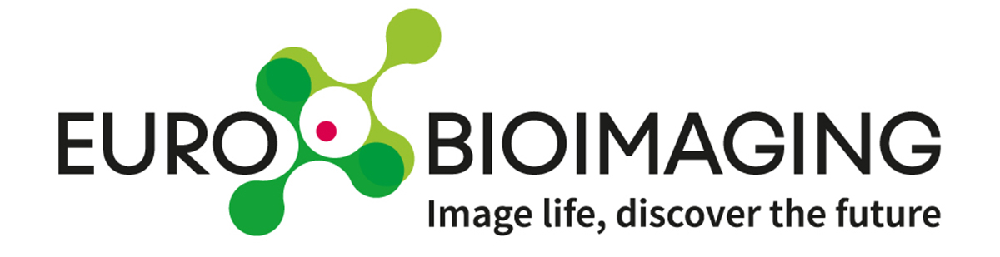
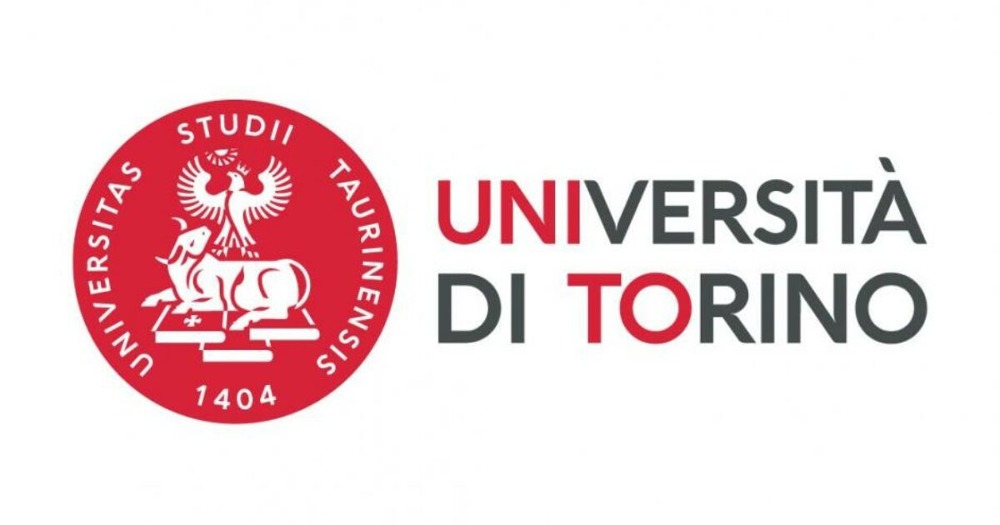
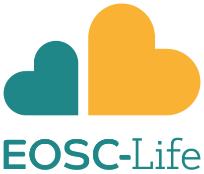
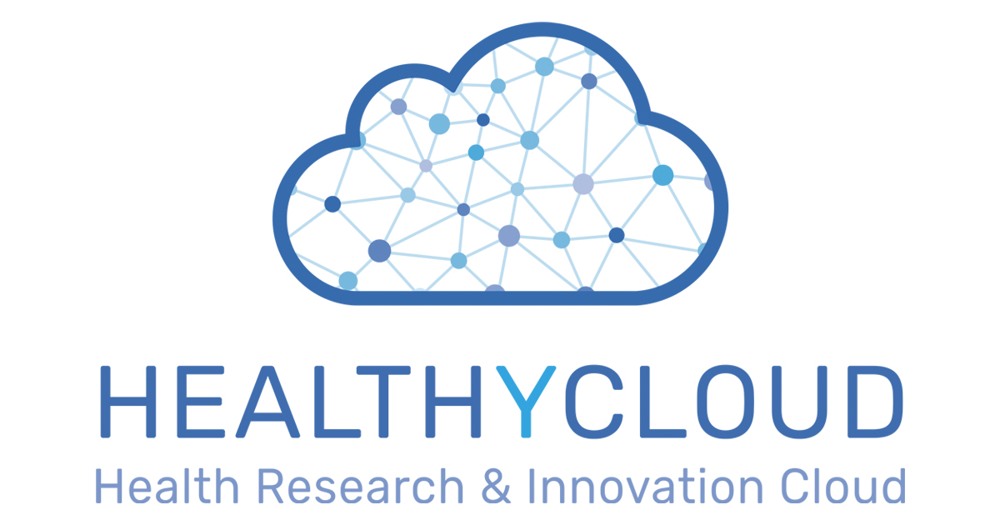

  <a href="https://www.eurobioimaging.eu/">
    
  </a>

---

# XNAT-PIC

XNAT for Preclinical Imaging Centers (XNAT-PIC) is a free and open-source Windows desktop application, which offers several tools to expand the XNAT core functionalities to support
the preclinical imaging community and to promote open science practices.

---

## Table of Contents
- [Overview](#overview)
- [Main Features](#main-features)
- [Architecture](#architecture)
- [Requirements](#requirements)
- [Installation](#installation)
- [Run the App](#run-the-app)
- [Releases](#releases)
- [Roadmap](#roadmap)
- [License](#license)
- [Citation](#citation)
- [News](#news)
- [Contact](#contact)
- [Funding](#funding)
- [Acknowledgments](#acknowledgments)

---

## Overview


Schematic view. (A) XNAT-PIC converts to DICOM multimodal images from several vendors, uploads, and annotates
preclinical images to the XNAT server. (B) Datasets can be processed via containerized workflows in XNAT. (C) Custom
plugins introduce new data types for optical and optoacoustic imaging, enabling users to upload, organize, and view
these images directly in XNAT.
---

## Main Features

### 1) XNAT-PIC Converter
Converts raw imaging data from MRI (Bruker) and Optical Imaging (IVIS) systems into the DICOM format.

### 2) Uploader
Uploads DICOM datasets to an XNAT instance, supporting workflows at the project, subject, and experiment levels.
The uploader also enables the management of imaging modalities not natively supported by XNAT, such as optical imaging and photoacoustic imaging.
### 3) Grouping Annotation Interface
Provides an interface to efficiently cope with different experimental protocols by labelling subjects with dedicated Custom Variables to manage several types of cohorts (e.g. treated/untreated, timepoints, doses, etc..)

---

## Architecture

The app is a Python desktop application built with **Flet** and organized in modules:
- `converter/` for conversion workflows,
- `uploader/` for XNAT upload workflows,
- `custom_form/` for metadata annotation,
- `xnat_client/` for XNAT API integration,

Entry point: `main.py`.

---

## Requirements

Python dependencies are listed in [`requirements.txt`](requirements.txt):
- `flet`
- `numpy`
- `pydicom`
- `pillow`
- `xnat`
- `python-dateutil`
 
---

## Installation

```bash
git clone https://github.com/ricgambino/XNAT-PIC.git
cd XNAT-PIC
python -m venv .venv
source .venv/bin/activate  # On Windows: .venv\Scripts\activate
pip install -r requirements.txt
```

---

## Run the App

From the repository root:

```bash
python main.py
```

This launches the desktop UI via Flet.

---

## Releases
The latest release can be downloaded here:

- **v2.1-beta.0** – [Download](https://github.com/cim-unito/XNAT-PIC/releases/tag/v2.1-beta.0)


## Roadmap

See [open issues](https://github.com/ricgambino/XNAT-PIC/issues) for planned features and known issues.

---

## License

XNAT-PIC is distributed under the terms of the GNU General Public License (GPL) v3 or later.
See [`LICENSE.md`](LICENSE.md) for details.

---

## Citation

If you use XNAT-PIC in your work, please cite:

- S. Zullino, A. Paglialonga, W. Dastrù, D. L. Longo, S. Aime. *XNAT-PIC: Extending XNAT to Preclinical Imaging Centers*, 2021. DOI/Preprint: https://arxiv.org/abs/2103.02044

---

## News

- "Demonstrator 5: XNAT-PIC: expanding XNAT for image archiving and processing to Preclinical Imaging Centers" — EOSC-Life: https://www.eosc-life.eu/d5/
- "Towards sharing and reusing of preclinical image data" — Euro-BioImaging: https://www.eurobioimaging.eu/news/towards-sharing-and-reusing-of-preclinical-image-data/
- "Data Management: Biological and Preclinical Imaging Perspective" — Euro-BioImaging Virtual Pub (Feb 12, 2021): [YouTube](https://youtu.be/QNiAGuFk53w)
- "XNAT-PIC: expanding XNAT for image archiving and processing to Preclinical Imaging Centers" — EOSC-Life Demonstrator Session 1 (Jan 13, 2021): [YouTube](https://youtu.be/cpEcfIJJqCo)

---

## Contact

**Francesco Gammaraccio**  
Molecular Imaging Center  
Department of Molecular Biotechnology and Health Sciences  
Via Nizza 52 | 10126 Torino, Italy  
francesco.gammaraccio@unito.it | T +39 011 670 6473

<a href="https://en.unito.it/">
  
</a>

**Kranthi Thej Kandula**  
Molecular Imaging Center  
Department of Molecular Biotechnology and Health Sciences  
Via Nizza 52 | 10126 Torino, Italy  
kranthithej.kandula@unito.it | T +39 011 670 6473

<a href="https://en.unito.it/">
  
</a>

---
 
## Funding

European Union’s Horizon 2020 / Horizon Europe programmes under grant agreements:
- #824087 (EOSC-Life)
- #965345 (HealthyCloud)
- #101058427 (EOSC4Cancer)
- #1011100633 (EUCAIM)

<a href="https://www.eosc-life.eu/">
  
</a>

<a href="https://healthycloud.eu/">
  
</a>

<a href="https://eosc4cancer.eu/"> 
  
</a>

<a href="https://eucanimage.eu/">
  
</a>

---

## Acknowledgments

- Alessandro Paglialonga: https://github.com/pagli17
- Stefan Klein, Hakim Achterberg and Marcel Koek — Biomedical Imaging Group Rotterdam, Erasmus Medical Center, Rotterdam
- Matteo Caffini, "Project-Beat--Python": https://github.com/mcaffini/Project-Beat---Python
- Sara Zullino: https://github.com/szullino